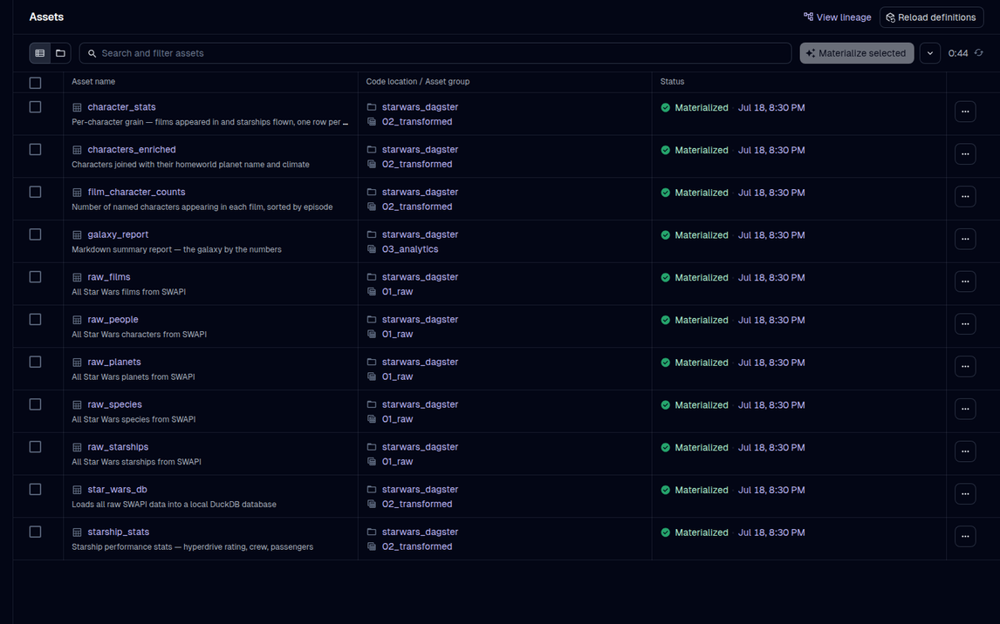
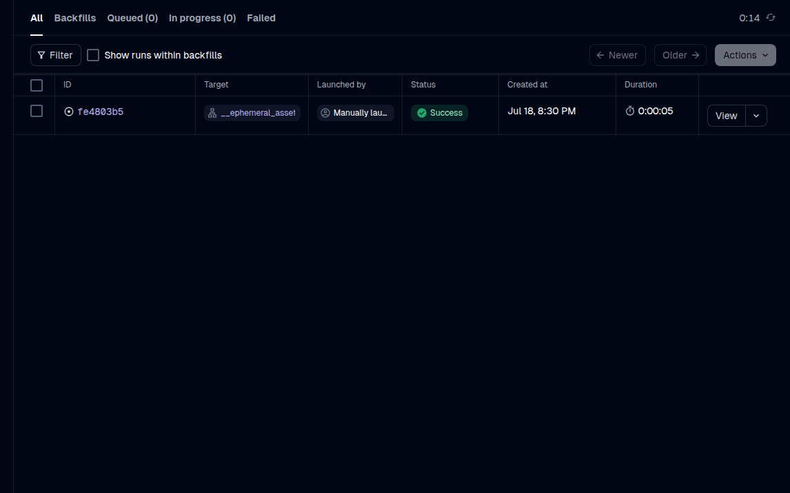

# Star Wars Dagster Pipeline

[](https://github.com/josephsapinoso/starwars-dagster/actions/workflows/ci.yml)

An end-to-end data engineering pipeline built with [Dagster OSS](https://dagster.io) that pulls live Star Wars data from the [SWAPI](https://swapi.info) REST API, transforms it with DuckDB, and generates an analytics report.

Built as a self-study workshop for learning Dagster fundamentals.

## Screenshots

### Asset Lineage Graph
The full dependency graph — all 10 assets across 3 groups, rendered by Dagster's built-in lineage view:


### Assets Catalog — All Materialized
Every asset freshly materialized, showing status, description, and last-run timestamp:



### Run History
A successful pipeline run completing in under a minute:



---

## Architecture

```
SWAPI (live API) → Raw JSON → DuckDB tables → SQL transforms → Markdown report
     ↑                ↑              ↑                ↑               ↑
  Resource        01_raw         star_wars_db    02_transformed   03_analytics
```

**10 assets across 3 groups:**

| Group | Assets | Description |
|---|---|---|
| `01_raw` | `raw_films`, `raw_people`, `raw_planets`, `raw_starships`, `raw_species` | HTTP pulls from SWAPI |
| `02_transformed` | `star_wars_db`, `characters_enriched`, `film_character_counts`, `starship_stats` | DuckDB storage + SQL |
| `03_analytics` | `galaxy_report` | Markdown summary report |

## Quick start

```bash
# 1. Install dependencies
pip install -e .

# 2. Launch Dagster UI
python -m dagster dev

# 3. Open http://localhost:3000 → Assets → Materialize all
```

## Stack

- **[Dagster](https://dagster.io)** — orchestration (open-source, free)
- **[DuckDB](https://duckdb.org)** — embedded analytics database
- **[SWAPI](https://swapi.info)** — Star Wars REST API (free, no auth)
- **Pandas** — DataFrame transforms
- **Python 3.11+**

## Testing & data quality

Tests run **offline** against committed fixtures; Dagster **asset checks** validate
the **live** pull at materialization time — code and data are guarded separately.

```bash
pip install -e ".[dev]" && pytest -v
```

- `tests/test_pipeline.py` materializes all 10 assets (plus every check) in-process
  with a fake `SWAPIResource` — no network, runs in seconds
- `starwars_dagster/assets/checks.py` — structural breakage **blocks** the run;
  upstream drift (SWAPI is someone else's dataset) only **warns**, with baselines
  in `known_facts.py`
- Deliberately *not* here: a second data-quality framework, coverage gates, or a
  CI matrix — Dagster-native checks and one green offline workflow carry the weight
- `scripts/snapshot_fixtures.py` freezes a dated real-API snapshot and unlocks the
  exact-value tests (82 people, 3 six-film characters, 23 unknown masses)

## What you'll learn

Working through the `WORKSHOP.md` file covers:

- Software-Defined Assets and the Dagster asset graph
- Resources (configurable API clients)
- Layered pipeline architecture (raw → staging → transform → analytics)
- SQL transforms with DuckDB's JSON functions
- Schedules for recurring runs
- Testing assets offline and validating live data with asset checks
- Re-executing from failure (not from scratch)
- Maintenance and observability patterns

## Output

After a successful run, `data/output/` contains:

- `galaxy_report.md` — characters, homeworlds, starship stats by film
- `characters_enriched.csv` — all characters joined with homeworld data
- `film_character_counts.csv` — cast size and starship count per episode
- `starship_stats.csv` — cleaned starship performance data

## Website — the Galaxy Report, visualized

`site/index.html` is a self-contained scroll story built on the pipeline's data: **"A Galaxy of 82 People"** — a census told through one unit chart of 82 dots that rearranges as you scroll (height, mass, homeworlds, film appearances, pilots), then hands off to a chart dashboard with the Dagster lineage and the DuckDB SQL behind every figure.

- Single file, no build step, no external dependencies — open it straight from disk
- Published as a Claude artifact: https://claude.ai/code/artifact/e71e41b6-f606-492c-af77-d19a8b3443d7
- Respects `prefers-reduced-motion`, works on mobile, and degrades to per-step figures in auto-height embeds

## Schedule

The pipeline includes a daily schedule (6 AM) that re-pulls from SWAPI — the same pattern you'd use for any REST API data feed.

```python
# schedules.py
daily_refresh_schedule = ScheduleDefinition(
    cron_schedule="0 6 * * *",
    job=full_pipeline_job,
)
```

## Project structure

```
starwars_dagster/
├── pyproject.toml
├── WORKSHOP.md                   ← self-study g