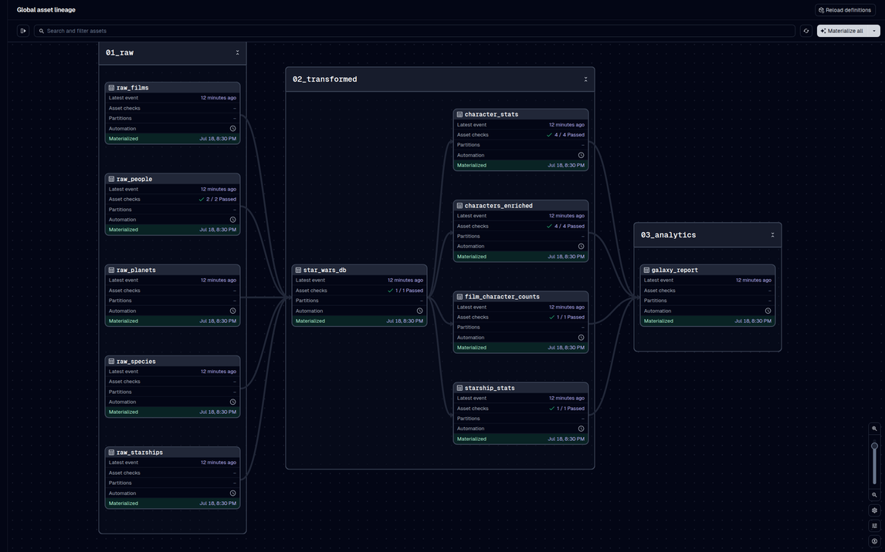

# Star Wars Galaxy Report

[](https://github.com/josephsapinoso/starwars-dagster/actions/workflows/ci.yml)

**An end-to-end [Dagster](https://dagster.io) pipeline — SWAPI → DuckDB → transforms → report —
whose companion data story is machine-verified against the pipeline that built it.** Every number
on the site names the asset that computed it and the check that guards it; every SQL string it
shows is executed against a fixture-built warehouse by the offline test suite, so what a reader
opens is provably what runs.

**Small on purpose.** 82 characters is a dataset you can verify entirely by hand — which is what
lets the guard layer *prove* the data story rather than decorate it.

**▶ [Open the live site](https://josephsapinoso.github.io/starwars-dagster/)** —
a scroll-told census of the 82 characters the saga keeps records on, ending in a chart
dashboard. Open any beat's **"paper trail"** to see the exact pipeline lineage and data-quality
checks behind that figure.
_(Also available as a [Claude artifact preview](https://claude.ai/code/artifact/e71e41b6-f606-492c-af77-d19a8b3443d7).)_

<!-- personal-site link slot: restore `Part of [my portfolio](URL)` here when the live URL ships -->



## The engineering, in one minute

- **Two guard layers, deliberately split.** pytest proves the *code* offline against committed
  fixtures; Dagster asset checks judge the *data* at materialization. Structural breakage
  **blocks** the run; upstream drift only **warns** — SWAPI is someone else's dataset, and
  freezing it would be pretending otherwise. Baselines live once, in
  [`known_facts.py`](starwars_dagster/known_facts.py), imported by both layers. The
  long-form version of this philosophy lives in
  [WORKSHOP.md Module 8](WORKSHOP.md#12-module-8--testing--asset-checks) and the
  [`checks.py`](starwars_dagster/assets/checks.py) docstring — this paragraph is the
  summary, not a second copy.
- **Provenance you can't fake.** The site's per-beat pipeline reveals are rendered from one
  `provenance` object embedded in the page, and
  [`tests/test_site_provenance.py`](tests/test_site_provenance.py) cross-checks every asset,
  dependency edge, check name, severity flag, and rationale string against the real Dagster
  definitions — including which numbers are guarded *offline only*, stated in plain words on
  the page rather than dressed up as live checks.
- **A drift detector in the page itself.** The site recomputes its headline stats from its own
  embedded data at load and warns on any mismatch with the prose — copy can't silently rot.
- **Deliberately absent:** a second data-quality framework, coverage gates, a CI matrix. One
  green offline workflow and Dagster-native checks carry the weight.

## Architecture

```
SWAPI (live API) ────┐
                     ├→ Raw JSON → DuckDB tables → SQL transforms → Markdown report
akabab (static JSON) ┘      ↑              ↑                ↑               ↑
     ↑                    01_raw       star_wars_db    02_transformed   03_analytics
  Resources
```

**13 assets across 3 groups, 20 asset checks (6 blocking, 14 warn):**

| Group | Assets | Description |
|---|---|---|
| `01_raw` | `raw_films`, `raw_people`, `raw_planets`, `raw_starships`, `raw_species`, `raw_character_profiles` | HTTP pulls: five SWAPI endpoints + the akabab profile dump |
| `02_transformed` | `star_wars_db`, `characters_enriched`, `film_character_counts`, `starship_stats`, `character_stats`, `character_biographies` | DuckDB storage + SQL, incl. the cross-source name join |
| `03_analytics` | `galaxy_report` | Markdown summary report |

The second source ([akabab/starwars-api](https://github.com/akabab/starwars-api)) is a
fan-curated, MIT-licensed, effectively frozen static dataset — a different trust level
than SWAPI, and the pipeline treats it that way: profiles attach to the census by exact
normalized name plus a curated alias map (no fuzzy matching; the one alias on file
corrects a SWAPI-side typo and says so), coverage is measured on both sides by a WARN
check, and death data is reported strictly as "on file" — the source records sequel-era
deaths and lags canon, so presence is the only honest claim.

## Quick start

```bash
# 1. Install dependencies
pip install -e .

# 2. Launch Dagster UI
python -m dagster dev

# 3. Open http://localhost:3000 → Assets → Materialize all
```

Run the offline test suite (no network needed):

```bash
pip install -e ".[dev]" && pytest -v
```

CI additionally pins transitive dependencies with `-c requirements.lock`
(regenerate via `uv pip compile pyproject.toml --extra dev -o requirements.lock`);
the version ranges in `pyproject.toml` stay authoritative for humans.

`scripts/snapshot_fixtures.py` freezes dated snapshots of both sources in one run and
unlocks the exact-value tests (82 people, 3 six-film characters, 23 unknown masses,
42 one-film cameos, 19 pilots — plus the profile-count, join-coverage, and
deaths-on-file baselines, which the script computes from the frozen pair rather than
anyone transcribing them). A daily 6 AM schedule re-pulls the sources — the same
pattern you'd use for any REST feed.

## Stack

- **[Dagster](https://dagster.io)** — orchestration (open-source, free)
- **[DuckDB](https://duckdb.org)** — embedded analytics database
- **[SWAPI](https://swapi.info)** — Star Wars REST API (free, no auth)
- **[akabab/starwars-api](https://github.com/akabab/starwars-api)** — character profiles
  (fan-curated static JSON, MIT, no auth)
- **Pandas** — DataFrame transforms
- **Python 3.11+**

## The website

[`site/index.html`](site/index.html) is one self-contained file: no build step, no CDNs, no
webfonts — open it straight from disk. It respects `prefers-reduced-motion`, works on mobile,
and degrades to per-step figures inside auto-height embeds. The scroll story rearranges one
unit chart of 82 dots (height, mass, homeworlds, film appearances, pilots), then hands off to
a dashboard carrying the Dagster lineage strip and the DuckDB SQL behind every chart — every
displayed string is executed against the fixture-built warehouse by the offline test suite,
so the SQL a reader opens is SQL that provably runs. A closing **"second reading"** panel
surfaces the akabab enrichment as on-file coverage — 82 of 82 census characters matched to a
curated profile, 47 with a death on file — every figure carrying its denominator and framed
as "on file," never as canon.

## Limits, by design

Ceilings I chose, and what would force each change:

- **Full refresh, no history.** Every run re-pulls every endpoint and rebuilds the
  warehouse from scratch — no incremental merge, no SCD, no change history. Right for a
  small static dataset; a source too big to re-pull, or a consumer asking "what changed
  since yesterday?", forces incremental loads and snapshotted dimensions.
- **DuckDB, single file.** Embedded analytics database: zero infrastructure, but one
  writer at a time and no concurrent consumers. A second tool or teammate reading the
  warehouse while it builds forces a shared engine.
- **No partitions.** The dataset is one small snapshot; a backfill is just a re-run.
  Date-stamped history or per-endpoint reprocessing would force partitioned assets.
- **Cron, not sensors.** SWAPI publishes no change events, so a daily schedule is the
  honest cadence. An upstream that signals updates forces event-driven sensors.
- **In-process executor, by policy.** Steps run sequentially to serialize on the DuckDB
  file lock — a race the test suite pins. Independent heavy steps plus a
  concurrency-safe warehouse would force multiprocess back on.

Why the *tooling* absences (one check framework, no coverage gates) are deliberate lives
in [WORKSHOP Module 10](WORKSHOP.md#14-module-10--going-further).

## Learn Dagster with this repo

[`WORKSHOP.md`](WORKSHOP.md) is a 15-module, from-zero tutorial written alongside the pipeline:
software-defined assets, resources, DuckDB SQL transforms, schedules, offline testing, asset
checks, and re-execution from failure.

## Decision records

Every significant design choice here is logged in
[`.claude/panel/decisions/`](.claude/panel/decisions/) — and the process earned its keep by
catching real bugs. It found that three of the site's headline numbers were computed by *no
pipeline asset*: those beats shipped honestly labeled as authoring-time tallies pinned by pytest,
and later the `character_stats` transform landed on its own merits and flipped them to direct
lineage with asset-check badges. The same review caught three of five displayed SQL strings that
never actually ran against the warehouse; now every displayed string lives in the page's data
payload and is executed and compared by the offline suite — the fix and its guard landed together.

The review process itself is in the repo: a standing panel of nine role agents (data engineer,
analyst, UX, storyteller, QA, a hiring-manager lens, and more) in
[`.claude/agents/`](.claude/agents/), each with persistent memory it updates before a debate and
banks after. The human adjudicates every verdict.

## Project structure

```
starwars-dagster/
├── pyproject.toml
├── README.md
├── WORKSHOP.md                   ← from-zero Dagster tutorial (15 modules)
├── starwars_dagster/
│   ├── __init__.py               ← Definitions (assets, checks, schedules, resources)
│   ├── known_facts.py            ← single source of verified baselines
│   ├── schedules.py
│   ├── assets/
│   │   ├── ingestion.py          ← 01_raw: five SWAPI pulls + one akabab pull
│   │   ├── transforms.py         ← 02_transformed: DuckDB + SQL
│   │   ├── analytics.py          ← 03_analytics: galaxy_report
│   │   └── checks.py             ← 20 asset checks (6 blocking, 14 warn)
│   └── resources/
│       ├── swapi_resource.py
│       └── akabab_resource.py
├── site/
│   └── index.html                ← the whole website, one file
├── tests/
│   ├── conftest.py               ← fake + inline resources for both sources
│   ├── test_pipeline.py          ← full offline materialization + banked facts
│   ├── test_transforms.py
│   ├── test_biographies.py       ← cross-source join contract + alias governance
│   ├── test_swapi_resource.py
│   ├── test_site_provenance.py   ← site provenance vs real Dagster defs
│   └── fixtures/                 ← committed fixtures + dated snapshot markers
├── scripts/
│   └── snapshot_fixtures.py      ← refresh fixtures from the live API
└── .claude/                      ← the design-panel agents, memories, decisions
```
